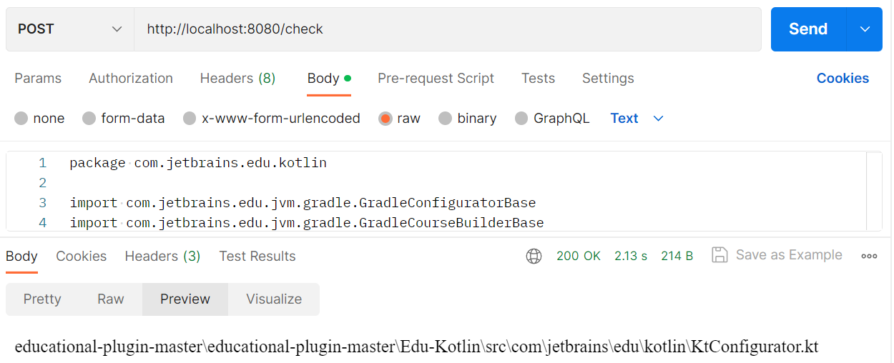
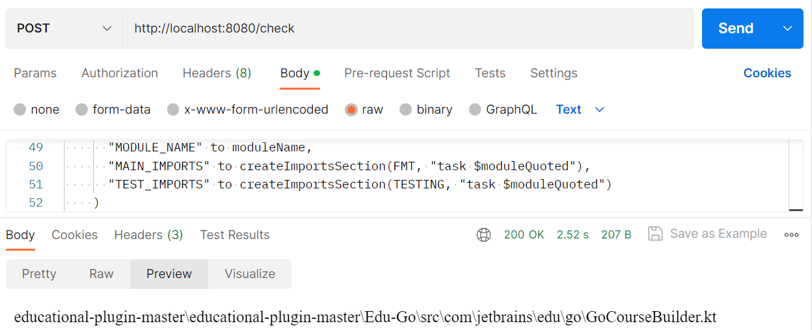
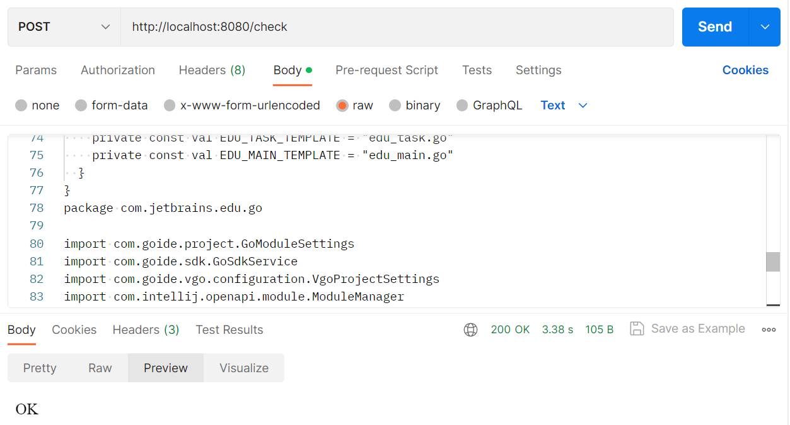

# Plagiarism code checker

The project consists of basic parts such as:

- Indexer (tokenize code and put tokens to PostgreSQL)
- Similarity Search Algorithm
- Web Service

The [Educational Plugin Jetbrains](https://github.com/JetBrains/educational-plugin) repository is now indexed as an
example.

## How to Run

The solution wrapped in docker

```sh
docker build -t code_checker .
```

```sh
docker run -p 8080:8080 code_checker
```

To simplify, it was decided to use the bare body of the request rather than json.

## How to Test

- You can use Postman to make a POST request to http://localhost:8080/check and put raw code in the Body.


- You can make a request using curl.

```sh
curl --location 'http://localhost:8080/check' \
--header 'Content-Type: text/plain' \
--data 'package com.jetbrains.edu.kotlin

import com.jetbrains.edu.jvm.gradle.GradleConfiguratorBase
import com.jetbrains.edu.jvm.gradle.GradleCourseBuilderBase
import com.jetbrains.edu.kotlin.checker.KtTaskCheckerProvider
import com.jetbrains.edu.learning.courseGeneration.GeneratorUtils.getInternalTemplateText
import org.jetbrains.kotlin.idea.KotlinIcons
import javax.swing.Icon

class KtConfigurator : GradleConfiguratorBase() {
  override val courseBuilder: GradleCourseBuilderBase
    get() = KtCourseBuilder()

  override val testFileName: String
    get() = TESTS_KT

  override fun getMockFileName(text: String): String = TASK_KT

  override val taskCheckerProvider: KtTaskCheckerProvider
    get() = KtTaskCheckerProvider()

  override val mockTemplate: String
    get() = getInternalTemplateText(MOCK_KT)

  override val logo: Icon
    get() = KotlinIcons.SMALL_LOGO

  override val defaultPlaceholderText: String
    get() = "TODO()"

  companion object {
    const val TESTS_KT = "Tests.kt"
    const val TASK_KT = "Task.kt"
    const val MAIN_KT = "Main.kt"
    const val MOCK_KT = "Mock.kt"
  }
}
'
```

## Examples



Here we can see that the algorithm has detected where the sent code came from.

But if we combine _GoCourseBuilder_ and _GoCourseProjectGenerator_ the result would be **OK!**. And that is the main
disadvantage of simple-way approach. 


## About Solution

At the current solution I have chosen the simplest version of the implementation. But for now (we may come to a
different opinion at the interview) I think it is better to store indices of a large repository in a database.
In the other case I would have to invent some data structure to divide indices into multiple files and not to pump a
huge size file into memory at once.

## How to Improve

- Speed up the indexing algorithm. I think it is better to look at multiprocessor indexing, only database interaction
  would be slow.


- Improve Similarity Search Algorithm. It currently does not consider the weights of each token. Here we could look
  towards Cosine
  Similarity. I also initially wanted to look towards the Jaccard Index. Depending on the idea and approach we will try
  to implement. And in general look into approaches used in NLP with adaptation to our code-based task.

In general, I don't really like the way Kotlin and Python code interact with each other at the moment. It is also
possible to increase code cleanliness by moving the required variables into the environment. 